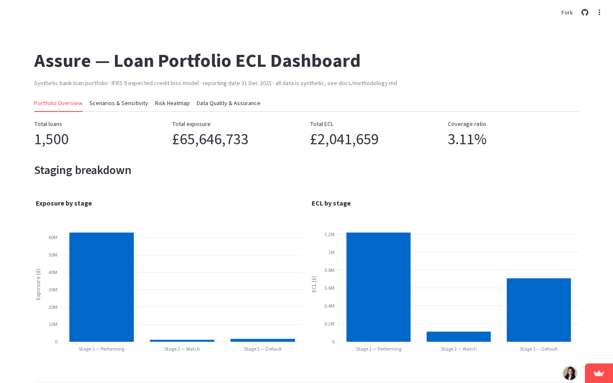

# Assure

A synthetic bank loan portfolio, an IFRS 9-style expected credit loss (ECL) model built
from scratch in Python, and a data-assurance/model-review layer that tests the model
the way an auditor would.

**Live dashboard: [assurebcm.streamlit.app](https://assurebcm.streamlit.app/)**



---

## Why I built this

My background is in audit — *testing* financial statements someone else prepared,
across healthcare, insurance, and government clients — not *building or reviewing* a
financial model. Modelling and practical coding ability are the other half of the job
in assurance and due-diligence work, so I built one, deliberately in a banking-adjacent
context, to see what that gap actually involves — and then reviewed it the way I'd have
been trained to: reconciling it, stress-testing it, and writing up the findings
honestly, limitations included.

## What's in here

1. A synthetic portfolio of 1,500 loans, generated reproducibly from a fixed random
   seed (`data/generate_portfolio.py`)
2. A real monthly amortisation engine — reducing-balance and bullet loans, calendar-
   accurate, not a shortcut (`model/amortisation.py`)
3. IFRS 9 Stage 1/2/3 classification and an ECL calculation (12-month for Stage 1,
   lifetime survival-curve for Stage 2, direct loss for Stage 3) (`model/staging.py`,
   `model/ecl.py`)
4. A macro scenario engine — base/adverse/severe, probability-weighted
   (`model/scenarios.py`)
5. A data-assurance layer: automated data quality checks, an independent
   recalculation test on a sample of loans, and reconciliation testing
   (`assurance/`)
6. A written **Model Validation Memo** — a real model-risk-style review of the whole
   thing, including a self-flagged independence limitation
   (`assurance/model_validation_memo.md`)
7. A Streamlit dashboard tying it all together (`app/dashboard.py`)

Full methodology — every formula, assumption, and disclosed simplification — is in
[`docs/methodology.md`](docs/methodology.md).

The proof behind it — the data, the process, the bug that was found and fixed, and what the checks do and don't detect — is
in [`evidence/`](evidence/).

## Headline result

A £65.6m synthetic portfolio, base-case ECL of **£2.04m (3.11% coverage)**, rising to a
probability-weighted **£2.43m** once base/adverse/severe macro scenarios are blended
(60/30/10 weighting). Full breakdown in the dashboard and in
[`docs/methodology.md`](docs/methodology.md).

## Data assurance approach

The differentiator of this project isn't the model — it's the review layer built on
top of it, styled like a genuine model-risk validation rather than a demo:

- **9/9 automated data quality checks passed** — duplicates, nulls, out-of-range
  values, categorical validity, and referential integrity across every derived file.
  One of these checks exists specifically because it caught a real bug during
  development: an earlier version of the data generator let 37% of loans already be
  fully matured before the reporting date — fixed at the source, not patched over.
- **25 loans independently recalculated from scratch** (a fresh implementation, not a
  re-run of the production code) — **25/25 matched** the model's own balance and ECL
  figures within a penny. This is the audit "test of detail" applied to code instead
  of a ledger.
- **Both reconciliations tie exactly**: loan-level ECL sums to the portfolio total,
  and a 3-month opening-to-closing ECL roll-forward balances to £0.00.

Full write-up, including what was explicitly *not* validated and why: the
[Model Validation Memo](assurance/model_validation_memo.md).

## Tech stack

Python (pandas, numpy), DuckDB-ready parquet files, Streamlit for the dashboard,
Plotly for charts, Faker for synthetic data generation. Chosen to be entirely
browser/cloud-based — built and run from a Chromebook, no desktop installs.

## How to run it locally

```bash
git clone https://github.com/VAishwaryaSingh/assure.git
cd assure
python -m venv .venv && source .venv/bin/activate
pip install -r requirements.txt

# rebuild the data and model outputs (already committed, but reproducible from scratch):
python data/generate_portfolio.py
python model/amortisation.py
python model/ecl.py
python model/scenarios.py

# run the assurance checks:
python assurance/data_quality_checks.py
python assurance/recalculation_test.py
python assurance/reconciliation.py
python assurance/sensitivity_analysis.py

# launch the dashboard:
streamlit run app/dashboard.py
```

## Limitations

Stated upfront, not left for a reader to discover:

- **PD and LGD are authored, disclosed assumptions** — not calibrated to any real
  bank's historical default or recovery data. The point was to be defensible and
  transparent about every number, not to be realistic to a specific institution.
- **No risk-grade-downgrade SICR trigger** — only the standard 30/90 days-past-due
  backstop is implemented, because the synthetic data has no risk-grade history to
  test a downgrade-based trigger against.
- **The model reviewer is not independent of the model developer** — both are me. A
  real bank's model risk function requires that separation; this project doesn't have
  it, and says so directly in the Model Validation Memo rather than glossing over it.
- **Synthetic data throughout.** Nothing here reflects a real bank, borrower, or
  portfolio.

Full detail on every assumption: [`docs/methodology.md`](docs/methodology.md).
